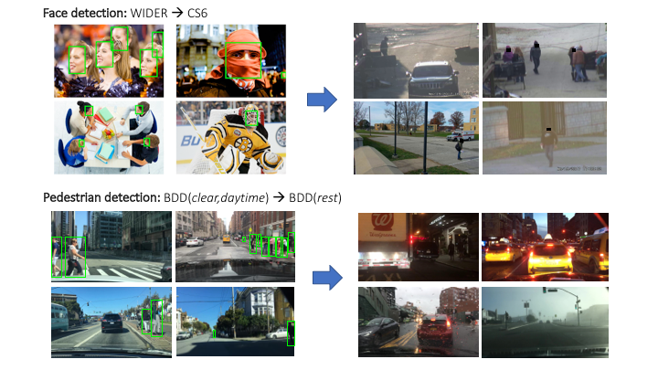
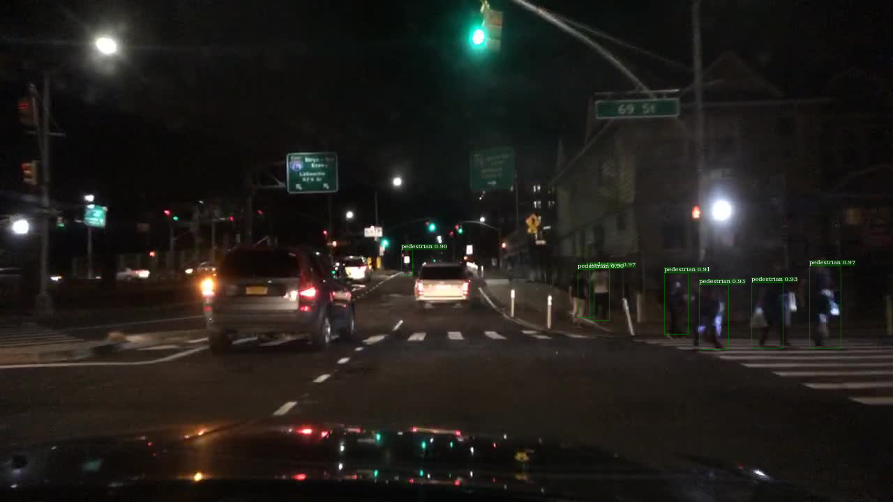
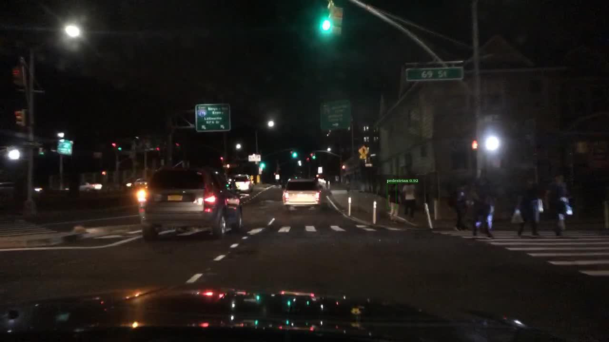

# PyTorch-Detectron for domain adaptation by self-training on hard examples




This codebase replicates results for pedestrian detection with domain shifts on the BDD100k dataset, following the CVPR 2019 paper [Automatic adaptation of object detectors to new domains using self-training](http://vis-www.cs.umass.edu/unsupVideo/docs/self-train_cvpr2019.pdf). We provide trained models, train and eval scripts as well as splits of the dataset for download. More details are available on the **[project page](http://vis-www.cs.umass.edu/unsupVideo/)**. 

This repository is heavily based off [A Pytorch Implementation of Detectron](https://github.com/roytseng-tw/Detectron.pytorch). We modify it for experiments on domain adaptation of face and pedestrian detectors. 

If you find this codebase useful, please consider citing:

```
@inproceedings{roychowdhury2019selftrain,
    Author = {Aruni RoyChowdhury and Prithvijit Chakrabarty  and Ashish Singh and SouYoung Jin and Huaizu Jiang and Liangliang Cao and Erik Learned-Miller},
    Title = {Automatic adaptation of object detectors to new domains using self-training},
    Booktitle = {IEEE Conference on Computer Vision and Pattern Recognition (CVPR)},
    Year = {2019}
}

```


## Getting Started
Clone the repo:

```
git clone git@github.com:AruniRC/detectron-self-train.git
```

### Requirements

Tested under python3.

- python packages
  - pytorch>=0.3.1
  - torchvision>=0.2.0
  - cython
  - matplotlib
  - numpy
  - scipy
  - opencv
  - pyyaml
  - packaging
  - [pycocotools](https://github.com/cocodataset/cocoapi)  — for COCO dataset, also available from pip.
  - tensorboardX  — for logging the losses in Tensorboard
- An NVIDAI GPU and CUDA 8.0 or higher. Some operations only have gpu implementation.
- **NOTICE**: different versions of Pytorch package have different memory usages.


## Installation
This walkthrough describes setting up this Detectron repo. The detailed instructions are in [INSTALL.md](INSTALL.md).


## Dataset
Create a data folder under the repo,

```
cd {repo_root}
mkdir data
```

### BDD-100k
Our pedestrian detection task uses both labeled and unlabeled data from the **Berkeley Deep Drive** [BDD-100k dataset](https://bdd-data.berkeley.edu/). Please register and download the dataset from their website. We use a symlink from our project root, `data/bdd100k` to link to the location of the downloaded dataset. The folder structure should be like this:

```
data/bdd100k/
    images/
        test/
        train/
        val/
    labels/
        train/
        val/
```

BDD-100k takes about 6.5 GB disk space. The 100k unlabeled videos take 234 GB space, but you do not need to download them, since we have already done the hard example mining on these and the extracted frames (+ pseudo-labels) are available for download.


### BDD Hard Examples
Mining the **hard positives** ("HPs") involve detecting pedestrians and tracklet formation on 100K videos. This was done on the UMass GPU Cluster and took about a week. We do not include this pipeline here (**yet**) -- the mined video frames and annotations are available for download as a gzipped tarball from [here](http://maxwell.cs.umass.edu/self-train/dataset/bdd_HP18k.tar.gz). **NOTE:** this is a large download (**23 GB**). *The data retains the permissions and licensing associated with the BDD-100K dataset (we make the video frames available here for ease of research).*

Now we create a symlink to the untarred BDD HPs from the project data folder, which should have the following structure: `data/bdd_peds_HP18k/*.jpg`. The image naming convention is `<video-name>_<frame-number>.jpg`.


### Annotation JSONs

All the annotations are assumed to be downloaded inside a folder `data/bdd_jsons` relative to the project root: `data/bdd_jsons/*.json`. We use symlinks here as well, in case the JSONs are kept in some other location.


| Data Split  | JSON |  Dataset name |  Image Dir. |
| ------------- | ------------- | ------------- | ------------- |
| BDD_Source_Train | [bdd_peds_train.json](http://maxwell.cs.umass.edu/self-train/dataset/bdd_jsons/bdd_peds_train.json) | bdd_peds_train | data/bdd100k  |
| BDD_Source_Val | [bdd_peds_val.json](http://maxwell.cs.umass.edu/self-train/dataset/bdd_jsons/bdd_peds_val.json) | bdd_peds_val | data/bdd100k  |
| BDD_Target_Train | [bdd_peds_not_clear_any_daytime_train.json](http://maxwell.cs.umass.edu/self-train/dataset/bdd_jsons/bdd_peds_not_clear_any_daytime_train.json) | bdd_peds_not_clear_any_daytime_train | data/bdd100k  |
| BDD_Target_Val | [bdd_peds_not_clear_any_daytime_val.json](http://maxwell.cs.umass.edu/self-train/dataset/bdd_jsons/bdd_peds_not_clear_any_daytime_val.json) | bdd_peds_not_clear_any_daytime_val | data/bdd100k  |
| BDD_dets | [bdd_dets18k.json](http://maxwell.cs.umass.edu/self-train/dataset/bdd_jsons/bdd_dets18k.json) | DETS18k | data/bdd_peds_HP18k  |
| BDD_HP | [bdd_HP18k.json](http://maxwell.cs.umass.edu/self-train/dataset/bdd_jsons/bdd_HP18k.json) | HP18k | data/bdd_peds_HP18k  |
| BDD_score_remap | [bdd_HP18k_remap_hist.json](http://maxwell.cs.umass.edu/self-train/dataset/bdd_jsons/bdd_HP18k_remap_hist.json) | HP18k_remap_hist | data/bdd_peds_HP18k  |
| BDD_target_GT | [bdd_target_labeled.json](http://maxwell.cs.umass.edu/self-train/dataset/bdd_jsons/vary_pure_target/bdd_peds_not_clear_any_daytime_train_subsampled_100.json) | bdd_peds_not_clear_any_daytime_train_100 | data/bdd100k  |


## Models

Use the environment variable `CUDA_VISIBLE_DEVICES` to control which GPUs to use. All the training scripts are run with 4 GPUs. The trained model checkpoints can be downloaded from the links under the column **Model weights**. The eval scripts need to be modified to point to where the corresponding model checkpoints have been downloaded locally. To be consistent, we suggest creating a folder under the project root like `data/bdd_pre_trained_models` and saving all the models under it.

The performance numbers shown are from *single* models (the same models available for download), while the tables in the paper show results averaged across 5 rounds of train/test.

| Method  | Model weights |  Config YAML |  Train script |  Eval script | AP, AR |
| ------------- | ------------- | ------------- | ------------- | ------------- | ------------- |
| Baseline | [bdd_baseline](http://maxwell.cs.umass.edu/self-train/models/bdd_ped_models/bdd_baseline/bdd_peds.pth)  | [cfg](configs/baselines/bdd100k.yaml)  |  [train](gypsum/scripts/train/bdd_scripts/bdd_baseline.sh)  |  [eval](gypsum/scripts/eval/bdd_scripts/baseline_source.sh)  |  15.21, 33.09  |
| Dets | [bdd_dets](http://maxwell.cs.umass.edu/self-train/models/bdd_ped_models/bdd_dets/bdd_dets_model_step29999.pth)  | [cfg](configs/baselines/bdd_peds_dets_bs64_4gpu.yaml)  |  [train](gypsum/scripts/train/bdd_scripts/bdd_source_and_dets18k.sh)  |  [eval](gypsum/scripts/eval/bdd_scripts/bdd_dets_source.sh)  |  27.55, 56.90  |
| HP | [bdd_hp](http://maxwell.cs.umass.edu/self-train/models/bdd_ped_models/bdd_HP/bdd_HP_model_step29999.pth)  | [cfg](configs/baselines/bdd_peds_dets_bs64_4gpu.yaml)  |  [train](gypsum/scripts/train/bdd_scripts/bdd_source_and_HP18k.sh)  |  [eval](gypsum/scripts/eval/bdd_scripts/bdd_hp_source.sh)  |  28.34, 58.04  |
| HP-constrained | [bdd_hp-cons](http://maxwell.cs.umass.edu/self-train/models/bdd_ped_models/bdd_HP-cons/bdd_HP-cons_model_step29999.pth)  | [cfg](configs/baselines/bdd_distill100_track100.yaml)  |  [train](gypsum/scripts/train/bdd_scripts/bdd_source_and_HP18k_distill100_track100.sh)  |  [eval](gypsum/scripts/eval/bdd_scripts/bdd_hp_cons_source.sh)  |  **29.57**, **56.48**  |
| HP-score-remap | [bdd_score-remap](http://maxwell.cs.umass.edu/self-train/models/bdd_ped_models/bdd_HP-score-remap/bdd_HP-score-remap_model_step29999.pth)  | [cfg](configs/baselines/bdd_distill100_track100.yaml)  |  [train](gypsum/scripts/train/bdd_scripts/bdd_source_and_HP18k_remap_hist.sh)  |  [eval](gypsum/scripts/eval/bdd_scripts/bdd_score_remap_source.sh)  |  28.11, 56.80  |
| DA-im | [bdd_da-im](http://maxwell.cs.umass.edu/self-train/models/bdd_ped_models/bdd_DA-im/bdd_DA-im_model_step29999.pth)  | [cfg](configs/baselines/bdd_domain_im.yaml)  |  [train](gypsum/scripts/train/bdd_scripts/bdd_source_and_HP18k_domain_im.sh)  |  [eval](gypsum/scripts/eval/bdd_scripts/bdd_domain_im_source.sh)  |  25.71, 56.29  |
| Src-Target-GT | [bdd_target-gt](http://maxwell.cs.umass.edu/self-train/models/bdd_ped_models/vary_pure_target/model_step29999.pth)  | [cfg](configs/baselines/bdd_peds_dets_bs64_4gpu.yaml)  |  [train](gypsum/scripts/train/bdd_vary_pure_target/bdd_source_and_labeled_100.sh)  |  eval  |  35.40, 66.26  |


## Inference demo

| HP-constrained  | Baseline |
| :-------------: | :------: |
|  |  |

The folder `gypsum/scripts/demo` contains two shell scripts that run the pre-trained [Baseline](http://maxwell.cs.umass.edu/self-train/models/bdd_ped_models/bdd_baseline/bdd_peds.pth) (BDD-Source trained) and [HP-constrained](http://maxwell.cs.umass.edu/self-train/models/bdd_ped_models/bdd_HP-cons/bdd_HP-cons_model_step29999.pth) (domain adapted to BDD Target) models on a sample image. Please change the `MODEL_PATH` variable in these scripts to where the appropriate models have been downloaded locally. Your results should resemble the example shown above. Note that the domain adapted model (HP-constrained) detects pedestrians with higher confidence (visualization threshold is 0.9 on the confidence score), while making one false positive in the background.

# Acknowledgement
This  material  is  based  on  research sponsored by the AFRL and DARPA under agreement num-ber FA8750-18-2-0126. The U.S. Government is authorized to reproduce and distribute reprints for Governmental purposes notwithstanding any copyright notation thereon. The views and conclusions contained herein are those of the authors and should not be interpreted as necessarily representing the official policies or endorsements, either expressed or implied, of the AFRL and DARPA or the U.S. Government. We acknowledge support from the MassTech Collaborative grant for funding the UMass GPU cluster. We thank Tsung-Yu Lin and Subhransu Maji for helpful discussions.

We appreciate the well-organized and accurate codebase for the Detectron implementation in PyTorch from the creators of [A Pytorch Implementation of Detectron](https://github.com/roytseng-tw/Detectron.pytorch). Also thanks to the creators of BDD-100k which has allowed us to share our pseudo-labeled video frames for our academic, non-commercial purpose of quickly reproducing results.

